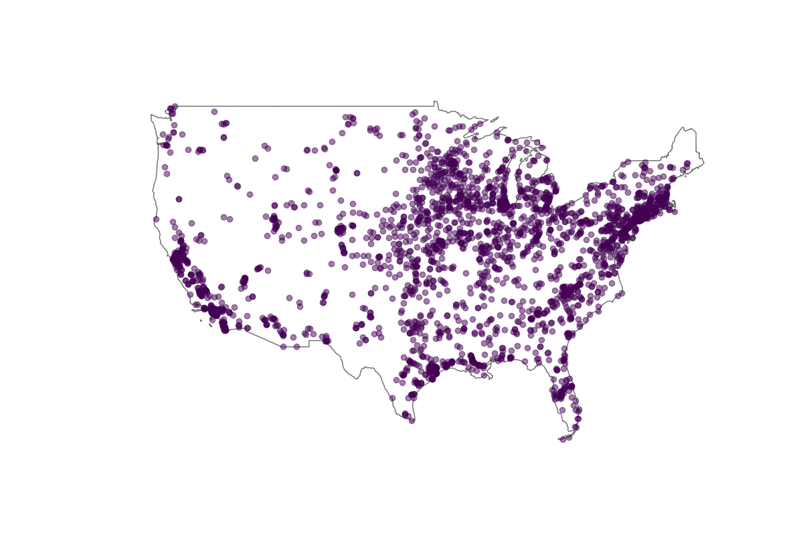
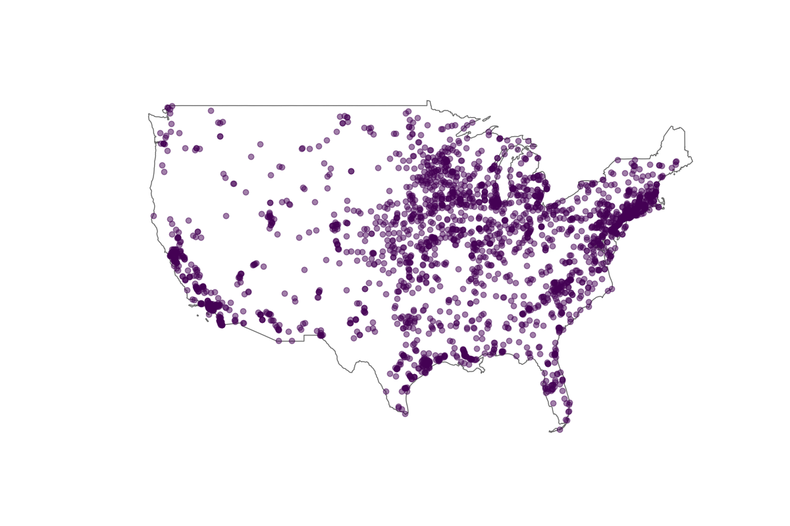
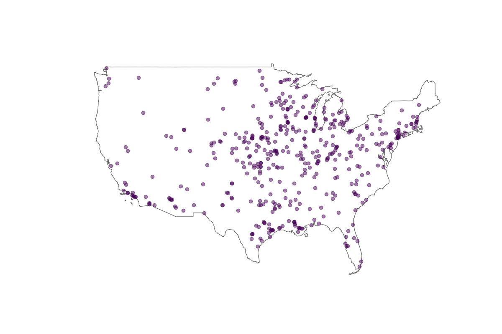
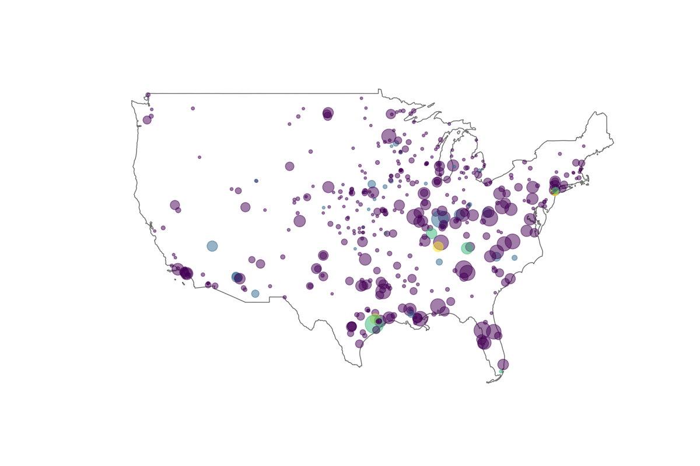
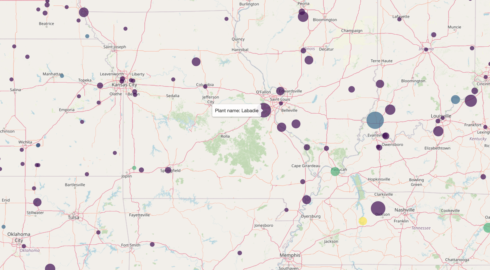

# clicab-maps

## Introduction

This project creates maps that attempt to illustrate the Climate Cabinet political research process.

## Requirements

This project is built using Python 3 and Jupyter Notebook. A complete list of libraries can be found in `requirements.txt`. They can be downloaded using the command

    pip3 install -r requirements.txt

## Outside sources

A shapefile containing all of the US power plants has been taken from the EIA website: <https://www.eia.gov/maps/layer_info-m.php>. This project uses the shapefile from the map layer titled "Power Plants."

A shapefile containing an outline of the US has been taken frrom the census website: <https://www.census.gov/geographies/mapping-files/time-series/geo/carto-boundary-file.html>. This project uses the shapefile titled `cb_2018_us_nation_20m.zip`.

## Description of maps

This project generates 5 static maps and one dynamic map.

The first static map displays every power plant in the United States, as reported by the Energy Information Administration.


The second filters the plants displayed by fossil fuel plants only.



The third filters the plants displayed by solely-owned plants only.



The fourth filters the plants displayed by plants with generators older than 30 years only.



The fifth contains the same data points as the fourth, but the size of the dot representing a power plant corresponds to the amount of power generated by the plant and the color represents the number of generators older than 30 years.



The dynamic map is the same as the fifth static map, but it allows zoom, hovering over a plant to see its name, and clicking on a plant to see additional information.



## Usage

The static maps can be generated by running the command
```
python3 static_maps.py
```

The dynamic map can be generated by running the Jupyter Notebook file
```
dynamic_maps.ipynb
```
