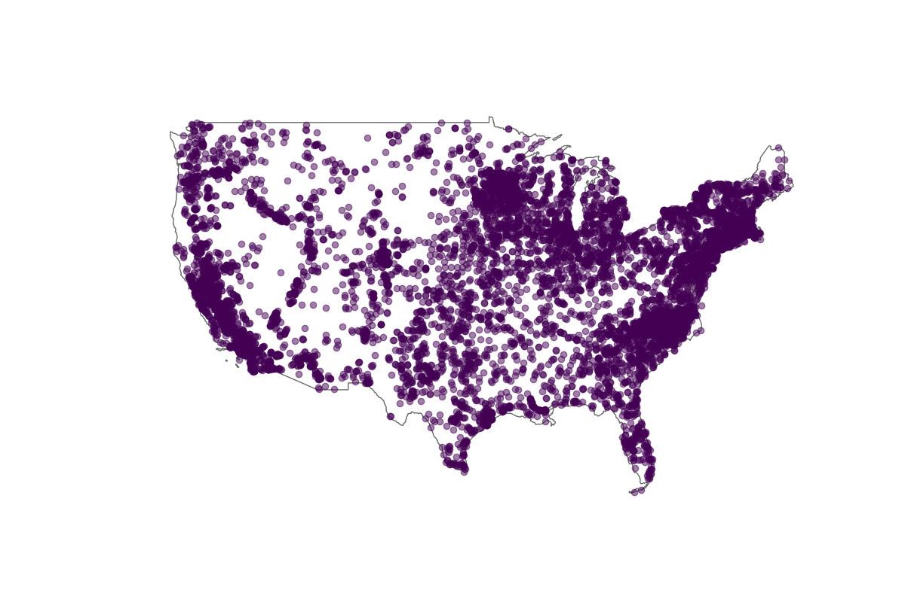

# clicab-maps

## Introduction

This project creates maps that attempt to illustrate the Climate Cabinet political research process.

## Requirements

This project is built using Python 3. A complete list of libraries can be found in `requirements.txt`. They can be downloaded using the command

    pip3 install -r requirements.txt

## Outside sources

A shapefile containing all of the US power plants has been taken from the EIA website: <https://www.eia.gov/maps/layer_info-m.php>. This project uses the shapefile from the map layer titled "Power Plants."

A shapefile containing an outline of the US has been taken frrom the census website: <https://www.census.gov/geographies/mapping-files/time-series/geo/carto-boundary-file.html>. This project uses the shapefile titled `cb_2018_us_nation_20m.zip`.

## Description of maps

This project generates 5 maps.

The first maps every power plant in the United States, as reported by the Energy Information Administration.

